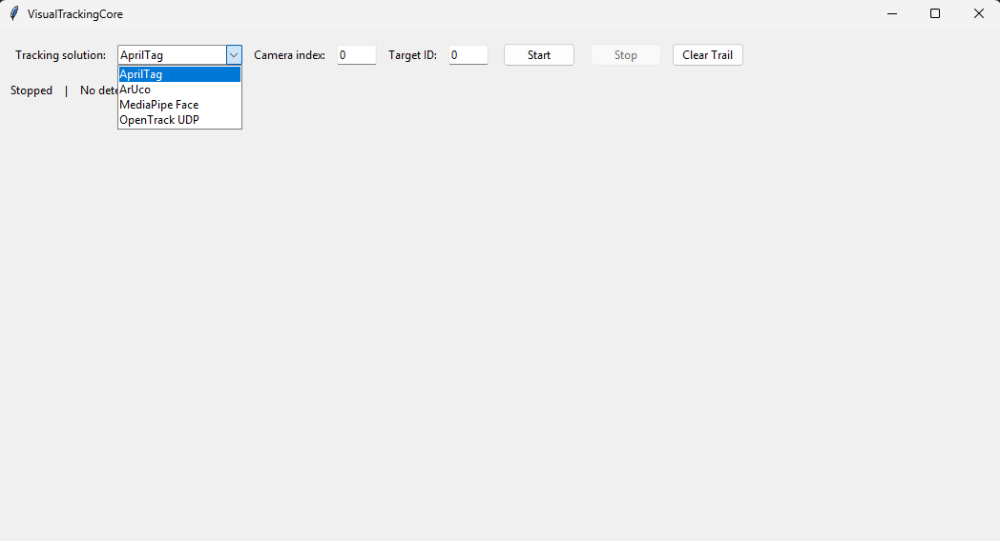
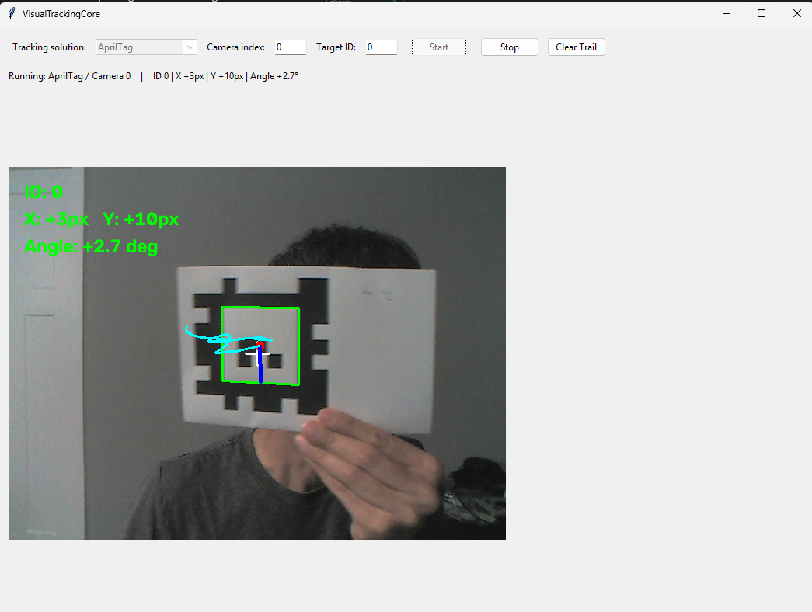

# VisualTrackingCore V0.5

Modular proof-of-concept framework for comparing head-tracking solutions through a common UI and adapter interface.

## Tracking adapters

The main UI currently supports four interchangeable tracking adapters. We can adapt this main UI for the final product if we decide to use multiple adapters.

### 1. AprilTag

**Type:** Marker-based webcam tracking  
**Best for:** Stable, repeatable position tracking when the participant can wear or carry a printed marker.

- Uses the `pupil-apriltags` detector.
- Default tag family: `tagStandard41h12`.
- The included sample marker uses ID `0`.
- Detects the marker center and orientation from the webcam image.
- A specific marker ID can be selected so other visible tags are ignored.
- Requires a clearly visible printed AprilTag with reasonable lighting and camera focus.

Sample marker files are included in the `markers/` folder.

```text
Additional References/Notes
- GitHub Link: https://github.com/AprilRobotics/apriltag
- Pre-generated images: https://github.com/AprilRobotics/apriltag-imgs
- Conversion program: ./tools/tag_to_svg.py
```

### 2. ArUco

**Type:** Marker-based webcam tracking  
**Best for:** Simple OpenCV-based marker experiments and easy generation of custom marker IDs.

- Uses OpenCV's built-in ArUco detector.
- Default dictionary: `DICT_4X4_50`.
- The included sample marker uses ID `0`.
- Detects marker center and orientation from the webcam image.
- A specific marker ID can be selected for tracking.
- New markers can be generated with `tools/generate_aruco.py`.

```text
Additional References/Notes
This adapter is similar in purpose to AprilTag, but relies entirely on OpenCV's ArUco implementation.
- GitHub Link: https://github.com/tentone/ARUCO
- Created the sample tag and resized in the separated program (Microsoft Word) 
```

### 3. MediaPipe Face

**Type:** Markerless webcam tracking  
**Best for:** Tracking a participant without requiring a hat, tag, or physical marker.

- Uses MediaPipe Face Landmarker.
- Detects one face at a time.
- Uses facial landmarks and OpenCV `solvePnP` to estimate approximate head pose.
- Reports head position/orientation through the same `TrackingResult` interface used by the marker adapters.
- Requires the `models/face_landmarker.task` model file; the current package includes it.
- Performance can vary with face angle, lighting, occlusion, and camera placement.

```text
Additional References/Notes
This is the primary markerless proof-of-concept adapter in the current project.
- GitHub Link: https://github.com/google-ai-edge/mediapipe
```

### 4. OpenTrack UDP

**Type:** External 6-DOF tracking input  
**Best for:** Using opentrack or another tracking pipeline while keeping VisualTrackingCore as the common display/integration layer.

- opentrack runs as a separate application and owns its webcam/tracking hardware.
- VisualTrackingCore receives processed pose data over UDP.
- No webcam is opened by VisualTrackingCore when this adapter is selected.
- Default UDP listener: `127.0.0.1:4242`.
- Receives six values: `X, Y, Z, Yaw, Pitch, Roll`.
- Yaw/Pitch/Roll are displayed in degrees.
- X/Y/Z are preserved exactly as sent by opentrack; no translation-unit conversion is applied.
- The UI shows a synthetic coordinate preview because the original camera image belongs to opentrack.

```text
Additional References/Notes
- GitHub Link: https://github.com/opentrack/opentrack
- Windows Only
- Standardalone program

#### OpenTrack setup

In opentrack:

1. Select the desired tracker, for example **NeuralNet tracker**.
2. Set **Output** to **UDP over network**.
3. Configure:

IP address: 127.0.0.1
Port:       4242

4. Start tracking in opentrack.
5. In VisualTrackingCore select **OpenTrack UDP**.
6. Leave the UDP port at **4242** and click **Start**.
```


## Main program screenshots

The `main.py` application provides a common user interface for selecting and testing the available tracking adapters.

### 1. Main window

The main window allows the user to select a tracking solution and configure adapter-specific options. The current V0.5 interface includes **AprilTag**, **ArUco**, **MediaPipe Face**, and **OpenTrack UDP**.



### 2. AprilTag tracking

Example of the **AprilTag** adapter running from the common UI. The live camera preview shows the detected marker, marker ID, X/Y offset from the image center, orientation angle, and movement trail.



### 3. ArUco tracking

Example of the **ArUco** adapter using the same main interface. The detected ArUco marker is highlighted in the camera preview and the current marker ID, X/Y offset, and orientation angle are displayed.


## Quick comparison

| Adapter | Marker Required | Camera Used by VisualTrackingCore | Main Purpose |
|---|---|---|---|
| AprilTag | Yes | Yes | Robust printed-tag tracking |
| ArUco | Yes | Yes | OpenCV marker tracking |
| MediaPipe Face | No | Yes | Markerless face/head tracking |
| OpenTrack UDP | Depends on opentrack tracker | No | External 6-DOF tracking integration |

## Setup

From PowerShell:

```powershell
py -3.13 -m venv .venv
.\.venv\Scripts\Activate.ps1
python -m pip install --upgrade pip
python -m pip install -r requirements.txt
python main.py
```

## Common adapter design

All adapters derive from `TrackingAdapter` and return `TrackingResult` objects. This keeps the main UI independent from the specific tracking technology.

Camera-based adapters receive frames from the common camera layer. External tracking solutions can set `uses_camera = False` and provide their own input transport, as demonstrated by the OpenTrack UDP adapter.

## Adding another adapter

Create a class derived from `TrackingAdapter`, implement the required detection behavior, and register it in:

```text
adapters/registry.py
```

The adapter will then be available through the same main UI architecture.
