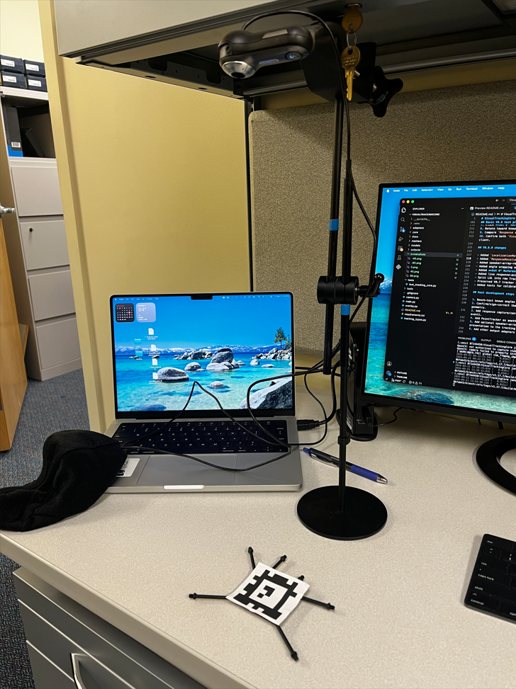
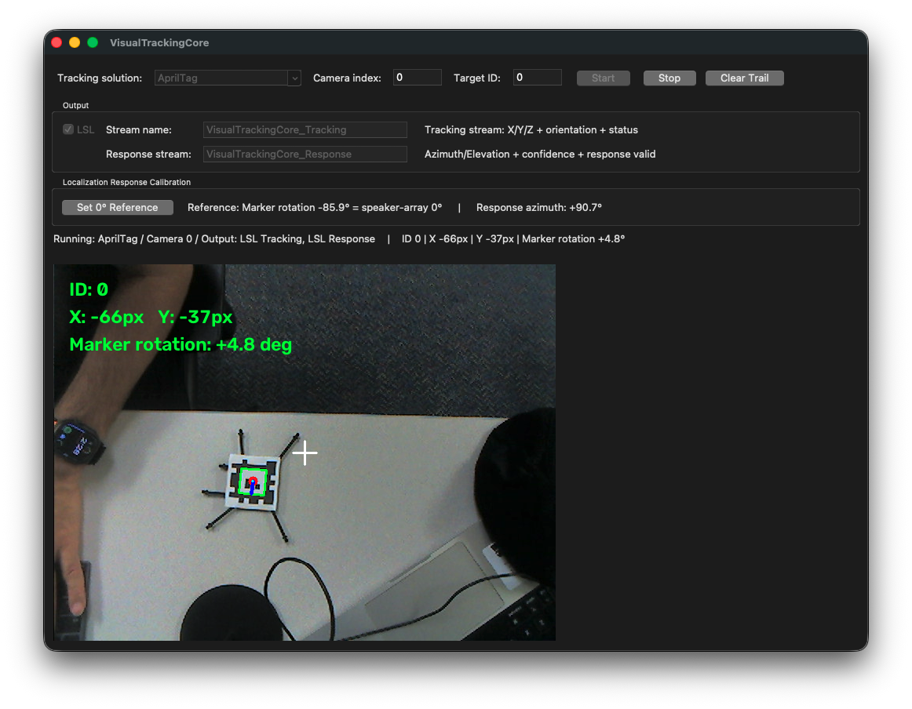
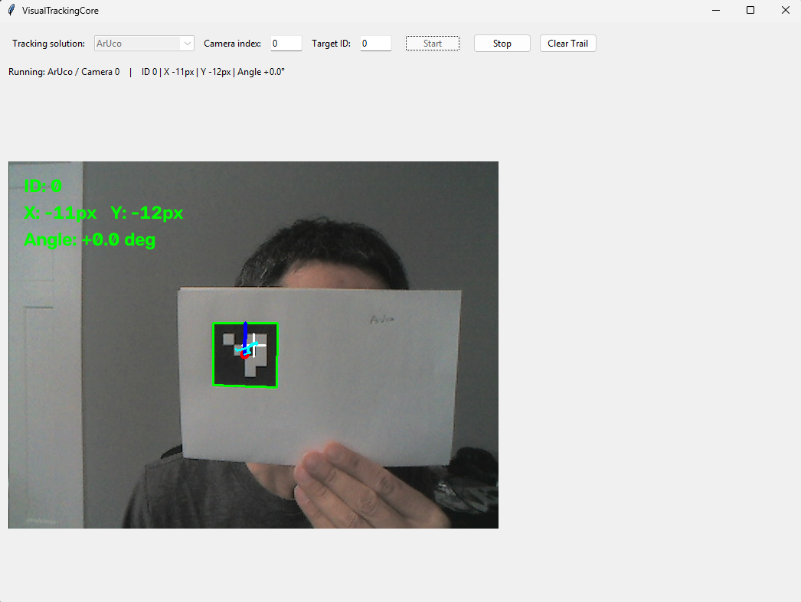

# VisualTrackingCore V0.8.2

VisualTrackingCore is a modular localization-response framework for spatial-hearing experiments. Different tracking technologies can be used to observe a participant, while the framework converts the observation into a common response direction relative to the speaker array.


[AprilTag tracking]






[ArUco tracking]


## ###In Development Below - FILL/FIX ME###

### Some Notes

- For our AprilTag/ArUco head-tracking setup, make the tag as large as you reasonably can while still fitting comfortably on the head/cap.
- Tag width ≈ 1/20 to 1/30 of the camera-to-tag distance

1. at 0.5 m distance → ~20–30 mm can work
2. at 1 m distance → ~40–60 mm is safer
3. at 1.5 m distance → ~60–80 mm is better

```text
AprilTag / ArUco test tag:
50 mm × 50 mm active tag area
~60–70 mm total printed card
```

### ArUco Marker Generator

`generate_aruco.py` creates a printable ArUco marker using the `DICT_4X4_50` dictionary.

Default:

```powershell
python generate_aruco.py
```

Generates:

```text
aruco_4x4_50_id0.png
```

Default values:

Marker ID: 0
Image size: 1000 × 1000 pixels

Optional parameters:

```powershell
python generate_aruco.py --id 5 --size 1500 --output my_marker.png
```

- `--id` marker ID
- `--size` image size in pixels
- `--output` output filename

The printed marker ID must match the ID selected in VisualTrackingCore.

### AprilTag-imgs
=============

Images of all tags from all the pre-generated [AprilTag 3](https://github.com/AprilRobotics/apriltags) families. You can generate your own layouts or images of tags using our other repo, [AprilTag-generation](https://github.com/AprilRobotics/apriltag-generation).

If the format of the markers is very small (ex : by default, 9x9 pixels), you'll need to rescale them. To do so, you may use the following imagemagick command (Unix) : 

~~~
convert <small_marker>.png -scale <scale_chosen_in_percent>% <big_marker>.png
~~~

Alternately, you can use the supplied native Python 3 script `tag_to_svg.py` to create a SVG (Scalable Vector Graphics) Version of a tag. For example:
~~~
python ./tools/tag_to_svg.py ./markers/tag41_12_00000.png ./markers/tag41_12_00000.svg --size=50mm
~~~

## Measurement model

V0.8.2 separates **sensor tracking data** from the **experimental localization response**.

```text
AprilTag / ArUco / MediaPipe / PointTracker
                         |
                         v
                  TrackingFrame
              raw normalized sensor pose
                         |
                         v
               ResponseResolver
              calibrated 0° reference
                         |
                         v
             LocalizationResponse
        speaker-array-relative response
                         |
                +--------+--------+
                |                 |
                v                 v
        LSL Tracking       LSL Response
```

The primary experiment-facing measurement is:

```text
response_azimuth_deg
```

`0°` is the participant's calibrated forward direction / speaker-array center. Elevation is included in the response model for future 3-D localization tasks but is not yet resolved by the current V0.8 calibration path.

## Two core data models

### TrackingFrame

Represents what the selected tracking technology measured.

```text
timestamp
source
target_id
tracking_valid
confidence
x / y / z
position_unit
yaw_deg / pitch_deg / roll_deg
```

Current adapter behavior:

| Adapter | Tracking orientation used for localization response |
|---|---|
| AprilTag | In-plane marker rotation (`roll_deg`) |
| ArUco | In-plane marker rotation (`roll_deg`) |
| MediaPipe Face | Estimated head `yaw_deg` |
| PointTracker | Planned |

For AprilTag and ArUco, this mapping assumes an overhead-camera arrangement where marker rotation in the image corresponds to horizontal head orientation. This should be verified experimentally for the final camera geometry.

### LocalizationResponse

Represents the experiment-facing response rather than raw tracker pose.

```text
timestamp
source
response_method
response_valid
confidence
response_azimuth_deg
response_elevation_deg
target_id
```

The response model intentionally does **not** contain the stimulus speaker ID, target angle, or localization error. Those are trial/experiment variables and should remain in the experimental software. VisualTrackingCore reports what direction the participant indicated.

## V0.8.2 terminology update

The UI now distinguishes the physical orientation measurement used by each tracker:

- **AprilTag / ArUco:** `Marker rotation` (2-D in-plane rotation in the camera image)
- **MediaPipe:** `Yaw`
- **Response azimuth:** the calibrated experiment-facing angle relative to speaker-array `0°`

This avoids describing the paper-marker measurement as generic `Angle` or full 3-D `Roll`.

## Calibration

While tracking is running:

1. Ask the participant to face the speaker-array center / intended `0°` direction.
2. Click **Set 0° Reference**.
3. VisualTrackingCore stores the current orientation as the reference.
4. Subsequent orientations are converted to signed azimuth relative to that reference.

Example:

```text
Calibration yaw:       +13.2°
Current yaw:           +48.5°
Response azimuth:      +35.3°
```

Angles are wrapped to the range `[-180°, 180°)`.

## LSL outputs

When LSL is enabled, V0.8.2 creates two independent streams.

### VisualTrackingCore_Tracking

Raw normalized tracking stream:

```text
x
y
z
yaw
pitch
roll
confidence
tracking_valid
target_id
```

Unavailable values are `NaN`. Tracking loss is explicit with `tracking_valid = 0`.

### VisualTrackingCore_Response

Experiment-facing response stream:

```text
response_azimuth
response_elevation
confidence
response_valid
target_id
```

Before calibration, or when the tracker is lost, `response_valid = 0` and unavailable response angles are `NaN`.

The response stream can therefore be consumed by MATLAB/Python experimental code without needing to understand whether the source was AprilTag, ArUco, MediaPipe, or a future PointTracker adapter.

## Project structure

```text
VisualTrackingCore/
├── main.py
├── camera.py
├── tracking_types.py
├── adapters/
│   ├── base.py
│   ├── apriltag_adapter.py
│   ├── aruco_adapter.py
│   ├── mediapipe_adapter.py
│   └── registry.py
├── core/
│   ├── tracking_frame.py
│   ├── localization_response.py
│   ├── response_resolver.py
│   └── tracking_engine.py
├── outputs/
│   ├── base.py
│   ├── lsl_output.py
│   └── lsl_response_output.py
├── models/
├── markers/
├── tools/
└── tests/
```

## Setup

From PowerShell:

```powershell
py -3.13 -m venv .venv
.\.venv\Scripts\Activate.ps1
python -m pip install --upgrade pip
python -m pip install -r requirements.txt
python main.py
```

From Bash:

```Bash
brew install python@3.13
brew install python-tk@3.13
python3.13 -m venv .venv
source .venv/bin/activate
python -m pip install --upgrade pip
python -m pip install -r requirements.txt
python main.py
```

## Basic V0.8 test procedure

1. Start `main.py`.
2. Select a tracker.
3. Keep LSL enabled if LabRecorder/another LSL client will be used.
4. Click **Start**.
5. Confirm raw tracking values update.
6. Face the center speaker / reference direction.
7. Click **Set 0° Reference**.
8. Rotate toward known speaker angles.
9. Compare `Response azimuth` with the known speaker positions.
10. Confirm both `VisualTrackingCore_Tracking` and `VisualTrackingCore_Response` appear in the LSL client.

## V0.8.0 changes

- Added `LocalizationResponse` experiment-facing data model.
- Added `ResponseResolver` calibration layer.
- Added speaker-array-relative `response_azimuth_deg`.
- Added angle wrapping across ±180°.
- Added **Set 0° Reference** control to the UI.
- Added live response-azimuth display.
- Split LSL into raw Tracking and calibrated Response streams.
- Preserved V0.7 tracker adapters and raw tracking behavior.
- Added tests for calibration, invalid tracking, response routing, and angle wrapping.

## Next development steps

1. Bench-test known angles (for example 0°, ±30°, ±60°, ±90°) for each current adapter.
2. Confirm/sign-correct the physical left/right azimuth convention for the actual camera/speaker geometry.
3. Add response capture/confirmation semantics (continuous vs participant/experimenter capture event).
4. Add PointTracker as another input adapter.
5. Add optional speaker-array configuration and validation tools without coupling stimulus presentation to the tracking core.
6. Add other output adapters only when required.

##

